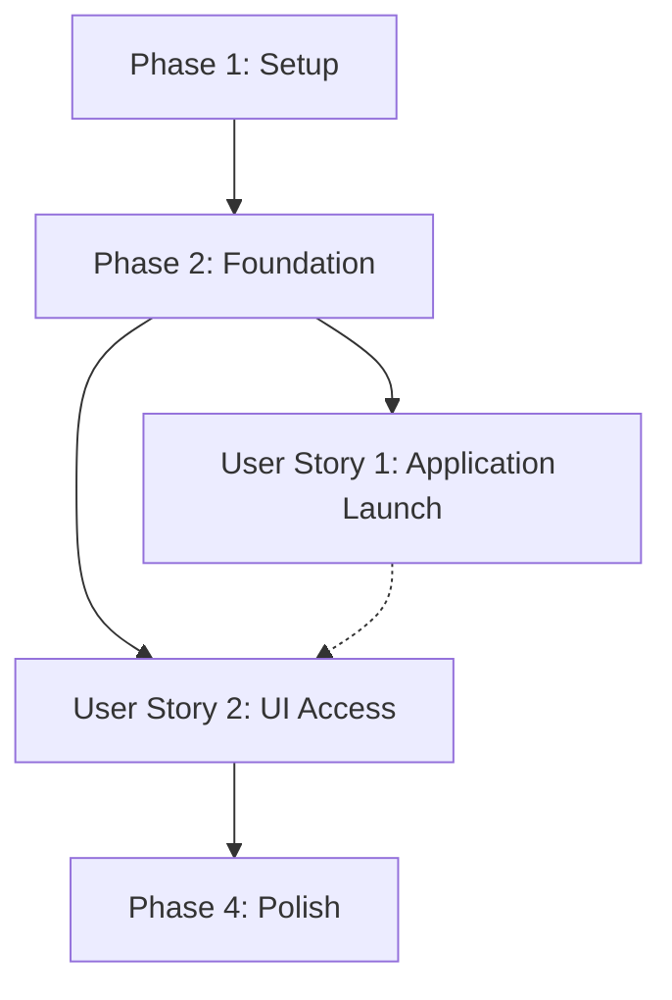

# Implementation Tasks: React Frontend Architecture

**Feature**: React Frontend Architecture
**Status**: Draft
**Input Plan**: `specs/007-react-frontend/plan.md`

## Dependency Graph

## Parallel Execution Examples

- **Foundation**: T002 (Vite Init) and T003 (Settings Toggle) can be done in parallel.
- **Integration**: T004 (FastAPI Update) depends on T002 and T003.

## Implementation Strategy

**Phase 1: Setup & Initialization**
Focus on creating the directory and the base Vite project.

**Phase 2: Foundation (Settings & FastAPI)**
Implement the configuration toggle and update the backend to respect it.

**Phase 3: User Story 1 (Launch Script)**
Create the unified Python launch script to handle the frontend build and backend startup.

**Phase 4: Polish & Documentation**
Ensure the quickstart validation passes and update relevant docs.

---

## Phase 1: Setup & Initialization

**Goal**: Prepare the repository structure for the new frontend.

- [x] T001 Ensure `src/arbitrator/presentation/react-ui` directory exists or is created during initialization.
- [x] T002 Initialize a new Vite React project with pnpm in `src/arbitrator/presentation/react-ui`. (e.g., `cd src/arbitrator/presentation && pnpm create vite react-ui --template react-ts`)
- [x] T003 Modify `src/arbitrator/presentation/react-ui/vite.config.ts` to ensure the build output directory is `dist` (default) and paths are relative if necessary.

## Phase 2: Foundation (Settings & FastAPI)

**Goal**: Implement the feature toggle and backend routing logic.

- [x] T004 [P] Add `USE_REACT_FRONTEND: bool = False` to `Settings` class in `src/arbitrator/config/settings.py`.
- [x] T005 Update `src/arbitrator/presentation/fastapi_app.py` to import `settings` and conditionally mount the `StaticFiles`.
- [x] T006 Ensure `fastapi_app.py` falls back to mounting `src/arbitrator/presentation/static` when `USE_REACT_FRONTEND` is false.
- [x] T007 Ensure `fastapi_app.py` mounts `src/arbitrator/presentation/react-ui/dist` when `USE_REACT_FRONTEND` is true.
- [x] T008 Update the catch-all route in `fastapi_app.py` (if it exists) to serve `index.html` from the currently active static directory to support SPA routing.

## Phase 3: User Story 1 - Application Launch

**Goal**: Automate the build and launch process.
**Independent Test**: Modify the toggle and run `scripts/run_app.py` to see automated builds and the correct UI served.

- [x] T009 [US1] Create a new file `scripts/run_app.py`.
- [x] T010 [US1] In `scripts/run_app.py`, load the application settings to check `USE_REACT_FRONTEND`.
- [x] T011 [US1] If `USE_REACT_FRONTEND` is true, use `subprocess.run` to execute `pnpm install` in the `src/arbitrator/presentation/react-ui` directory.
- [x] T012 [US1] If `USE_REACT_FRONTEND` is true, use `subprocess.run` to execute `pnpm build` in the same directory.
- [x] T013 [US1] Start the FastAPI server using `uvicorn.run("main:app", host="0.0.0.0", port=8000)` at the end of `scripts/run_app.py`.
- [x] T014 [US1] Update `main.py` (if it currently launches the app) to either import `run_app.py` logic or point users to the new script.

## Phase 4: Polish & Documentation

**Goal**: Validate the implementation against the quickstart guide.

- [ ] T015 Verify Scenario 1 from `quickstart.md` (Legacy UI loads without build steps).
- [ ] T016 Verify Scenario 2 from `quickstart.md` (Modern UI builds and loads).
- [ ] T017 Update `CLAUDE.md` to reflect the new `scripts/run_app.py` command for launching the application.
